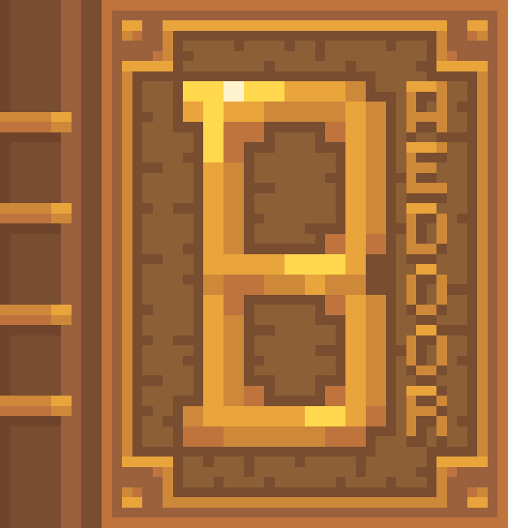

== Welcome in Baedoor Encyclopaedia ==

This is the place where you will be able to read everything on Baedoor universe, compressed into
one enormous repository. link:Entrance.md[Enter the Encyclopaedia].

// #### Translations
// If you want to translate the entries, [contact me](https://linktr.ee/toma400) so I can either create
// new branch (for new languages) or allow PRs from you (for existing ones).

=== Baedoor universe is currently used in... ===
- https://baedoor.github.io/projects/_mods_mc.html[Minecraft mods]
- https://github.com/Toma400/The_Isle_of_Ansur[Isle of Ansur game]
- https://baedoor.github.io/todo.html[Future projects]
- https://baedoor.github.io/projects/fsam.html[Future Morrowind mod]
- Various writings of mine